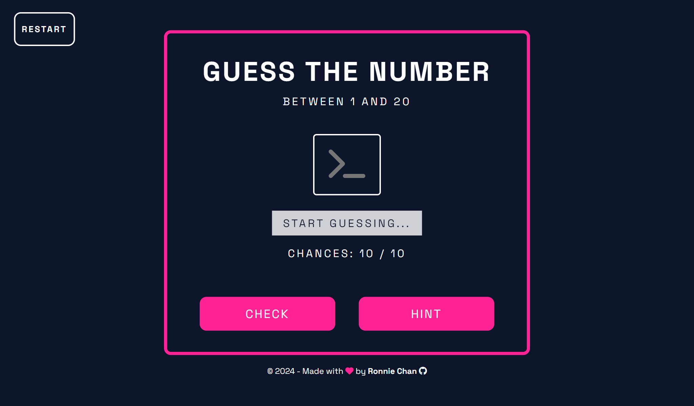
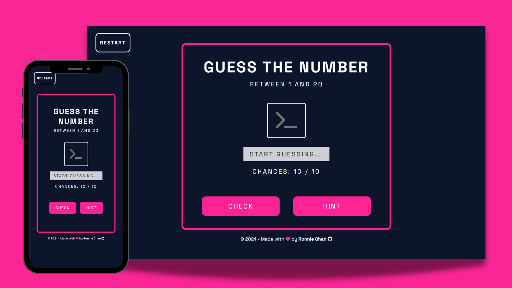
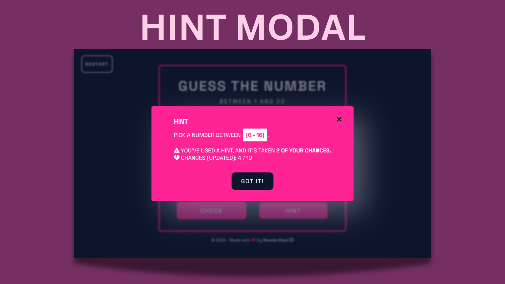
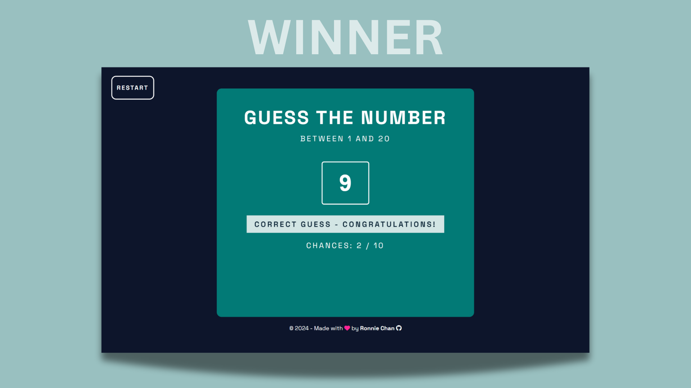
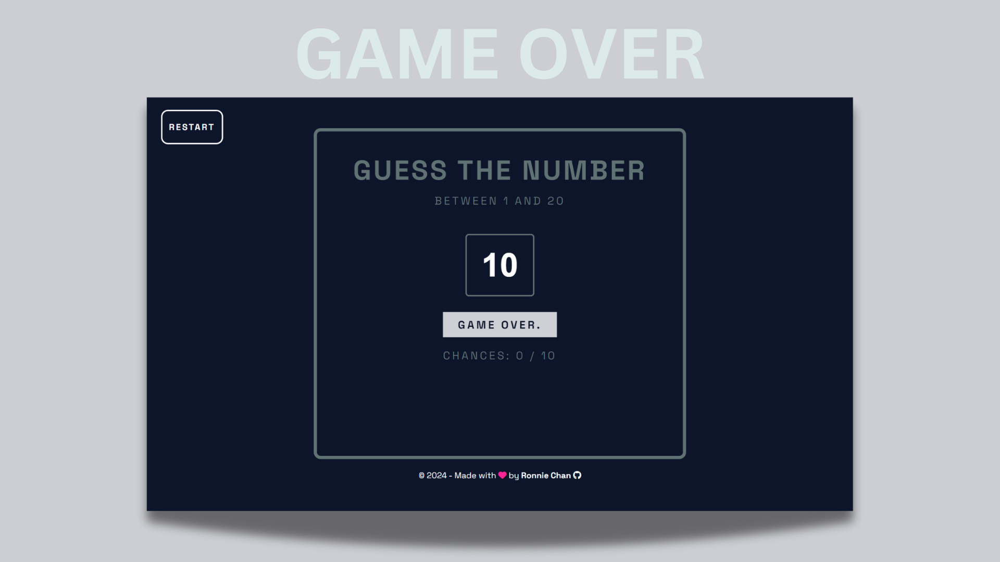

# Number Guessing Game

## About this project

The goal of this project is to create a simple (yet deadly 💀) interactive number guessing game that runs in the browser using HTML, CSS, and JavaScript. Inspired by the thrilling theme of "Squid Game", players need to guess a number between 1 and 20, with only a limited number of chances to get it right. The game features various setups for winning and losing, hint functionality, and responsive design.

 

## Rules

- The player is asked to guess a number between 1 and 20.
- The player has 10 chances to guess the number correctly.
- Each incorrect guess results in a loss of 1 chance.
- Using a hint will cost 2 additional chances.
- If the player guesses correctly, the game switches to a "winner" setup.
- If the player runs out of chances, the game switches to a "game over" setup.

## Features

- **CSS Flexbox** for arranging HTML elements
- Dynamic game setups for win/lose scenarios using CSS classes and JavaScript
- **Responsive design** with media queries
- **DOM manipulation** for button functionality and game logic management
- **Modal window** for optional hints during gameplay

## Technologies

   

## Screenshots

Below are previews of the different game setups.  
For a higher-resolution view, you can access the full PDF [here](./images/number-guessing-screenshots.pdf).

## Licence

&copy; 2024 - This project is licensed under the [MIT License](./LICENSE).
